# Diagram architektury autentykacji - GdziePies

<authentication_analysis>

## Analiza przepływów autentykacji

### 1. Przepływy autentykacji wymienione w dokumentacji

#### 1.1. Rejestracja użytkownika (US-001)
- Użytkownik wchodzi na `/rejestracja`
- Strona Astro sprawdza server-side czy użytkownik jest zalogowany
- Jeśli zalogowany → przekierowanie na `/`
- Renderowanie komponentu `AuthForm` w trybie `register`
- Walidacja formularza przez Zod (email, password, confirmPassword)
- Wywołanie `client.auth.signUp()` z Supabase
- Supabase tworzy użytkownika i wyzwala trigger `handle_new_user`
- Oczekiwanie na sesję (300ms delay)
- Automatyczne logowanie po rejestracji
- Przekierowanie na `/` lub `redirectTo`

#### 1.2. Logowanie użytkownika (US-002)
- Użytkownik wchodzi na `/logowanie?redirectTo=/zasób`
- Strona Astro sprawdza server-side czy użytkownik jest zalogowany
- Jeśli zalogowany → przekierowanie na `/`
- Renderowanie komponentu `AuthForm` w trybie `login`
- Walidacja formularza przez Zod (email, password)
- Wywołanie `client.auth.signInWithPassword()` z Supabase
- Supabase weryfikuje dane i zwraca sesję
- Sesja zapisywana w localStorage przez Supabase
- Przekierowanie na `/` lub `redirectTo`

#### 1.3. Wylogowanie użytkownika
- Użytkownik klika "Wyloguj się" w Header
- Wywołanie `client.auth.signOut()` z Supabase
- Usunięcie sesji z localStorage
- Przekierowanie na `/`
- Synchronizacja stanu przez `onAuthStateChange` we wszystkich komponentach

#### 1.4. Dostęp do chronionych zasobów
- Użytkownik próbuje uzyskać dostęp do chronionego zasobu
- Komponent sprawdza sesję przez `client.auth.getSession()`
- Jeśli brak sesji → przekierowanie na `/logowanie?redirectTo=/zasób`
- Po zalogowaniu automatyczne przekierowanie z powrotem
- Komponent ponownie sprawdza sesję → sesja istnieje
- Wyświetlenie chronionego zasobu

#### 1.5. Middleware autoryzacji
- Każde żądanie przechodzi przez middleware
- Middleware ekstrahuje token z nagłówka `Authorization: Bearer <token>` lub cookie
- Ustawienie sesji w kontekście Supabase dla RLS
- Przekazanie klienta Supabase do `Astro.locals.supabase`

#### 1.6. Odświeżanie tokenu
- Supabase automatycznie odświeża token (`autoRefreshToken: true`)
- `onAuthStateChange` wykrywa zmiany sesji
- Wszystkie komponenty nasłuchujące aktualizują się automatycznie

### 2. Główni aktorzy i ich interakcje

**Aktorzy:**
1. **Przeglądarka** - inicjuje żądania, przechowuje sesję w localStorage
2. **Middleware** - ekstrahuje token, ustawia sesję dla RLS
3. **Strony Astro** - renderują strony server-side, sprawdzają autoryzację
4. **Komponenty React** - walidują formularze, wywołują Supabase Auth
5. **Supabase Auth** - zarządza użytkownikami i sesjami
6. **API Endpoints** - weryfikują token, wykonują operacje z RLS

**Interakcje:**
- Przeglądarka ↔ Strony Astro (renderowanie HTML)
- Przeglądarka ↔ Komponenty React (interakcje użytkownika)
- Komponenty React ↔ Supabase Auth (operacje autoryzacji)
- Middleware ↔ Supabase Auth (ustawienie sesji dla RLS)
- API Endpoints ↔ Supabase Auth (weryfikacja tokenu)

### 3. Procesy weryfikacji i odświeżania tokenów

**Weryfikacja tokenu:**
- Middleware ekstrahuje token z nagłówka `Authorization` lub cookie
- Token jest ustawiany w kontekście Supabase przez `setSession()`
- RLS używa `auth.uid()` do sprawdzania uprawnień
- API endpoints weryfikują token przez `getUser(token)`

**Odświeżanie tokenu:**
- Supabase automatycznie odświeża token przed wygaśnięciem
- `onAuthStateChange` nasłuchuje zmian sesji
- Komponenty aktualizują stan użytkownika automatycznie
- Wygaśnięcie sesji powoduje przekierowanie do logowania

### 4. Opis kroków autentykacji

**Krok 1: Inicjalizacja**
- Middleware tworzy klienta Supabase dla żądania
- Ekstrakcja tokenu z nagłówka lub cookie
- Ustawienie sesji w kontekście Supabase

**Krok 2: Renderowanie strony**
- Layout pobiera użytkownika server-side przez `getUser()`
- Przekazanie `initialUser` do komponentu Header
- Iniekcja konfiguracji Supabase do `window.__SUPABASE_URL__`

**Krok 3: Interakcja użytkownika**
- Użytkownik wypełnia formularz logowania/rejestracji
- Walidacja po stronie klienta przez Zod
- Wywołanie metody Supabase Auth (`signUp`/`signInWithPassword`)

**Krok 4: Weryfikacja i sesja**
- Supabase weryfikuje dane użytkownika
- Tworzenie sesji i tokenu JWT
- Zapisanie sesji w localStorage (client-side)
- Ustawienie sesji w kontekście Supabase (server-side)

**Krok 5: Przekierowanie i synchronizacja**
- Przekierowanie na docelową stronę z `redirectTo`
- `onAuthStateChange` synchronizuje stan we wszystkich komponentach
- Komponenty aktualizują UI na podstawie stanu autoryzacji

**Krok 6: Dostęp do chronionych zasobów**
- Komponent sprawdza sesję przez `getSession()`
- Jeśli brak sesji → przekierowanie do logowania
- Po zalogowaniu automatyczne przekierowanie z powrotem
- Wyświetlenie chronionego zasobu

</authentication_analysis>

<mermaid_diagram>

</mermaid_diagram>

```mermaid
sequenceDiagram
    autonumber
    participant Browser as Przeglądarka
    participant Middleware as Middleware Astro
    participant AstroPage as Strona Astro
    participant AuthForm as AuthForm React
    participant SupabaseAuth as Supabase Auth
    participant API as API Endpoint
    participant Database as Baza Danych

    Note over Browser,Database: Przepływ rejestracji użytkownika

    Browser->>AstroPage: GET /rejestracja
    activate AstroPage
    AstroPage->>Middleware: Przekazanie żądania
    activate Middleware
    Middleware->>Middleware: Ekstrakcja tokenu z cookie/nagłówka
    Middleware->>SupabaseAuth: setSession({ access_token })
    SupabaseAuth-->>Middleware: Sesja ustawiona (lub brak)
    deactivate Middleware
    AstroPage->>AstroPage: getUser() - brak użytkownika
    AstroPage-->>Browser: Render HTML z AuthForm
    deactivate AstroPage

    Browser->>AuthForm: Hydratacja komponentu
    activate AuthForm
    AuthForm->>AuthForm: Walidacja Zod (email, hasło)
    
    Browser->>AuthForm: Submit formularza
    AuthForm->>SupabaseAuth: signUp({ email, password })
    activate SupabaseAuth
    SupabaseAuth->>Database: Utworzenie użytkownika
    Database->>Database: Trigger handle_new_user
    Database-->>SupabaseAuth: Profil utworzony
    SupabaseAuth-->>AuthForm: Użytkownik utworzony
    deactivate SupabaseAuth
    
    AuthForm->>AuthForm: Oczekiwanie 300ms
    AuthForm->>SupabaseAuth: getSession()
    SupabaseAuth-->>AuthForm: Sesja zwrócona
    AuthForm->>Browser: Zapis sesji w localStorage
    AuthForm->>Browser: Redirect na / lub redirectTo
    deactivate AuthForm

    Note over Browser,Database: Przepływ logowania użytkownika

    Browser->>AstroPage: GET /logowanie?redirectTo=/zasób
    activate AstroPage
    AstroPage->>Middleware: Przekazanie żądania
    activate Middleware
    Middleware->>Middleware: Ekstrakcja tokenu z cookie/nagłówka
    Middleware->>SupabaseAuth: setSession({ access_token })
    SupabaseAuth-->>Middleware: Sesja ustawiona (lub brak)
    deactivate Middleware
    AstroPage->>AstroPage: getUser() - brak użytkownika
    AstroPage-->>Browser: Render HTML z AuthForm
    deactivate AstroPage

    Browser->>AuthForm: Hydratacja komponentu
    activate AuthForm
    AuthForm->>AuthForm: Walidacja Zod (email, hasło)
    Browser->>AuthForm: Submit formularza (po walidacji)
    AuthForm->>SupabaseAuth: signInWithPassword({ email, password })
    activate SupabaseAuth
    SupabaseAuth->>Database: Weryfikacja danych
    Database-->>SupabaseAuth: Dane poprawne
    SupabaseAuth-->>AuthForm: Sesja zwrócona
    deactivate SupabaseAuth
    AuthForm->>Browser: Zapis sesji w localStorage
    AuthForm->>Browser: Redirect na / lub redirectTo
    deactivate AuthForm

    Note over Browser,Database: Przepływ dostępu do chronionego zasobu

    Browser->>AstroPage: GET /moje-konto
    activate AstroPage
    AstroPage->>Middleware: Przekazanie żądania
    activate Middleware
    Middleware->>Middleware: Ekstrakcja tokenu z cookie
    Middleware->>SupabaseAuth: setSession({ access_token })
    activate SupabaseAuth
    SupabaseAuth-->>Middleware: Sesja ustawiona
    deactivate SupabaseAuth
    Middleware-->>AstroPage: Klient Supabase z sesją
    deactivate Middleware
    AstroPage->>AstroPage: getUser() - sprawdzenie użytkownika
    AstroPage-->>Browser: Render HTML z DashboardGuard
    deactivate AstroPage

    Note over Browser: DashboardGuard (komponent React)
    Browser->>SupabaseAuth: getSession()
    activate SupabaseAuth
    alt Sesja istnieje
        SupabaseAuth-->>Browser: Sesja zwrócona
        Browser->>Browser: Wyświetlenie dashboardu
    else Brak sesji
        SupabaseAuth-->>Browser: Brak sesji
        Browser->>Browser: Redirect na /logowanie?redirectTo=/moje-konto
    end
    deactivate SupabaseAuth

    Note over Browser,Database: Przepływ wywołania API z autoryzacją

    Browser->>API: POST /api/announcements<br/>Authorization: Bearer token
    activate API
    API->>Middleware: Przekazanie żądania
    activate Middleware
    Middleware->>Middleware: Ekstrakcja tokenu z nagłówka
    Middleware->>SupabaseAuth: setSession({ access_token })
    activate SupabaseAuth
    SupabaseAuth-->>Middleware: Sesja ustawiona
    deactivate SupabaseAuth
    Middleware-->>API: Klient Supabase z sesją
    deactivate Middleware
    
    API->>SupabaseAuth: getUser(token)
    activate SupabaseAuth
    SupabaseAuth-->>API: Użytkownik zwrócony
    deactivate SupabaseAuth
    
    alt Token poprawny
        API->>Database: INSERT announcement<br/>RLS sprawdza auth.uid()
        activate Database
        Database-->>API: Ogłoszenie utworzone
        deactivate Database
        API-->>Browser: 201 Created
    else Token niepoprawny
        API-->>Browser: 401 Unauthorized
    end
    deactivate API

    Note over Browser,Database: Przepływ wylogowania

    Browser->>Browser: Kliknięcie "Wyloguj się"
    Browser->>SupabaseAuth: signOut()
    activate SupabaseAuth
    SupabaseAuth->>SupabaseAuth: Usunięcie sesji z localStorage
    SupabaseAuth-->>Browser: Wylogowanie zakończone
    deactivate SupabaseAuth
    Browser->>Browser: Redirect na /
    Browser->>SupabaseAuth: onAuthStateChange wykrywa zmianę
    activate SupabaseAuth
    SupabaseAuth-->>Browser: Event: SIGNED_OUT
    deactivate SupabaseAuth
    Browser->>Browser: Aktualizacja UI (Header, komponenty)

    Note over Browser,Database: Przepływ odświeżania tokenu

    Browser->>SupabaseAuth: Automatyczne odświeżanie tokenu
    activate SupabaseAuth
    alt Token wymaga odświeżenia
        SupabaseAuth->>SupabaseAuth: Odświeżenie tokenu
        SupabaseAuth->>Browser: Nowy token w localStorage
        SupabaseAuth-->>Browser: onAuthStateChange: TOKEN_REFRESHED
    else Token wygasł
        SupabaseAuth-->>Browser: onAuthStateChange: SIGNED_OUT
        Browser->>Browser: Redirect na /logowanie
    end
    deactivate SupabaseAuth

    Note over Browser,Database: Przepływ dostępu do danych kontaktowych

    Browser->>Browser: Kliknięcie "Pokaż dane kontaktowe"
    Browser->>SupabaseAuth: getSession()
    activate SupabaseAuth
    alt Sesja istnieje
        SupabaseAuth-->>Browser: Sesja zwrócona
        Browser->>API: RPC get_contact_details<br/>Authorization: Bearer token
        activate API
        API->>Middleware: Przekazanie żądania
        activate Middleware
        Middleware->>SupabaseAuth: setSession({ access_token })
        SupabaseAuth-->>Middleware: Sesja ustawiona
        deactivate Middleware
        API->>Database: Wywołanie funkcji RPC<br/>RLS sprawdza autoryzację
        activate Database
        Database-->>API: Dane kontaktowe zwrócone
        deactivate Database
        API-->>Browser: 200 OK z danymi
        Browser->>Browser: Wyświetlenie danych kontaktowych
    else Brak sesji
        SupabaseAuth-->>Browser: Brak sesji
        Browser->>Browser: Redirect na /logowanie?redirectTo=/ogloszenia/123
    end
    deactivate SupabaseAuth
    deactivate API

```

## Opis diagramu

Diagram przedstawia kompleksowy przepływ autentykacji w aplikacji GdziePies, wykorzystującej Astro 5, React 19 i Supabase Auth. Diagram pokazuje następujące scenariusze:

1. **Rejestracja użytkownika** - pełny cykl od wypełnienia formularza do utworzenia konta i automatycznego logowania
2. **Logowanie użytkownika** - proces uwierzytelniania z obsługą przekierowania
3. **Dostęp do chronionego zasobu** - mechanizm ochrony stron wymagających autoryzacji
4. **Wywołanie API z autoryzacją** - weryfikacja tokenu i wykonywanie operacji z RLS
5. **Wylogowanie** - proces zakończenia sesji i synchronizacji stanu
6. **Odświeżanie tokenu** - automatyczne zarządzanie wygasaniem sesji
7. **Dostęp do danych kontaktowych** - przykład użycia RPC z autoryzacją

Diagram uwzględnia wszystkie kluczowe komponenty systemu: Middleware Astro, strony server-side, komponenty React, Supabase Auth oraz API endpoints, pokazując jak współpracują ze sobą w procesie autentykacji.

